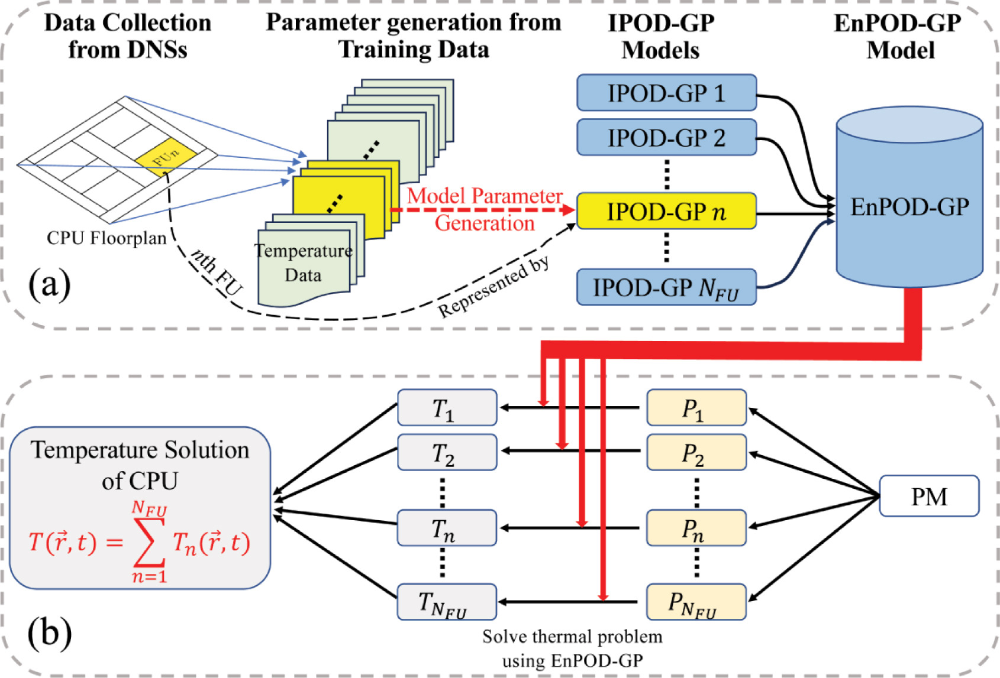

# EnPOD
EnPOD (Ensemble Proper Orthogonal Decomposition with Galerkin Projection, EnPOD-GP) is a thermal simulation methodology developed for multi-core CPUs that balances accuracy, efficiency, and scalability. Unlike the earlier GPOD-GP approach, which generates a single global set of POD modes for the entire chip and thus requires extensive training to capture variations in all power sources, EnPOD constructs multiple independent POD models—one for each functional unit (FU). Each individual POD model is trained separately using temperature data induced by the FU’s own power source, and the full-chip thermal profile is then obtained through superposition. This ensemble strategy eliminates the need for global training power maps, significantly reduces training effort, and improves robustness and accuracy, particularly for processors with many cores. Compared to finite element simulations, EnPOD delivers orders-of-magnitude speedup while maintaining fine spatial and temporal resolution, making it well-suited for large-scale dynamic thermal analysis and practical runtime applications such as thermal-aware task scheduling and reliability management.
<p align="center">
  
</pr>

If you use any component of PODTherm-GP, please cite:
```
[1] Jiang L, Dowling A, Liu Y, Cheng M-C. Ensemble learning model for effective thermal simulation of multi-core CPUs. Integration. 2024;97:102201.
```
# How to install and run EnPOD
## 1. Dependencies
### FEniCS platform installation
PODTherm-GP thermal simulator is developed on the FEniCS platform, which provides a flexible framework for solving partial differential equations (PDEs) using finite element methods. FEniCS should be pre-installed using the following command:  
```
sudo apt-get install --no-install-recommends software-properties-common  
sudo add-apt-repository ppa:fenics-packages/fenics  
sudo apt-get update  
sudo apt-get install fenics
```
Please refer to the FEniCS installation guide for more detailed instructions on installation and troubleshooting: [FEniCS download](https://fenicsproject.org/download/.).

### Building tools installation   
To run the C++ version FEniCS, you need to make sure that the build tools are installed
```
sudo apt install cmake make g++ -y
```
### C++ FEniCS installation
If the cmake are installed on your server, you can then run the following commands to install C++ version FEniCS
```
sudo apt-get install --no-install-recommends software-properties-common
sudo add-apt-repository ppa:fenics-packages/fenics
sudo apt-get update
sudo apt-get install --no-install-recommends fenics
```
## 2. Ensemble POD model generation
### Training data collection
The training temperature data for an individual POD model of a functional unit (FU) can be obtained through numerical simulations or experimental measurements. The following example (the code can be obtained from [PODTherm-GP](https://github.com/WilbertJiang/PODTherm_GP)) illustrates how to collect temperature data using FEM on the FEniCS platform. Unlike PODTherm-GP, however, power is applied only to the target FU, while all other FUs remain idle.
```
    cd ./src  
    ffc -l dolfin Space.ufl  
    cd ..  
    mkdir build  
    cd ./build  
    cmake ..  
    make 
 ```
 Then the executable file can be run with one or multiple processes. For instance, the component of training data collection can be performed by 
 ```
 mpirun -n 20 ./Therm_FEM
 ```
